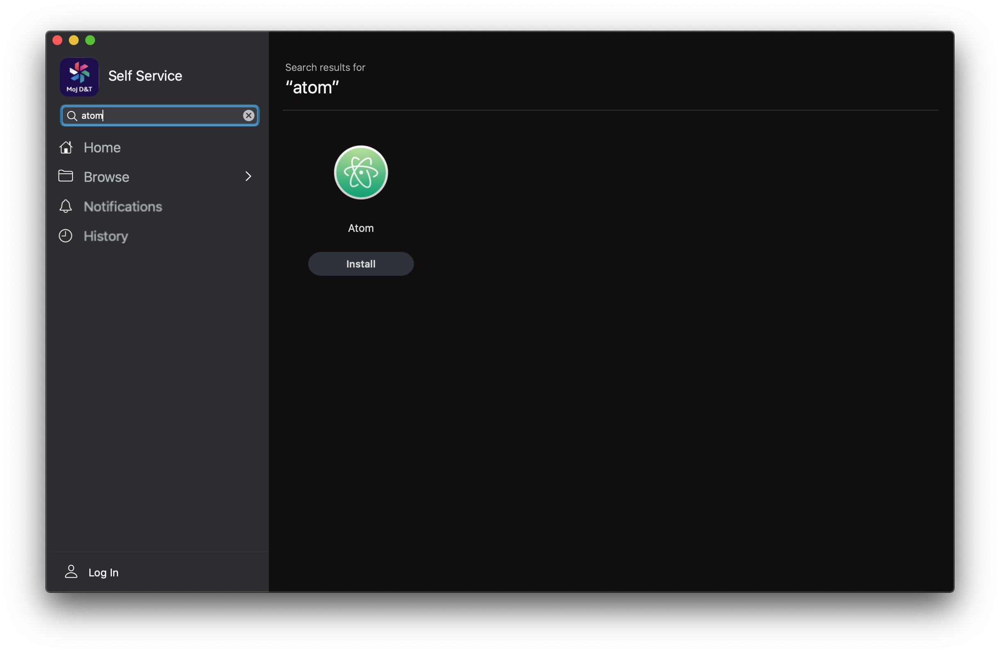
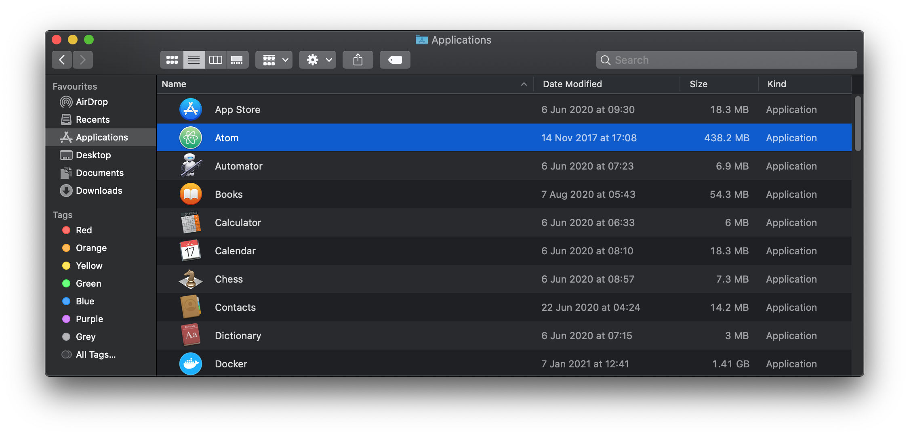

# Setting up your computer
## Text editor (Atom)

Programmers use **text editors** to write code. You could use Notepad (Windows) or TextEdit (Mac) to write code. However most programmers use a text editor with programming-specific features:

* **Syntax highlighting** shows your code in different colours. This helps you spot any errors and understand the structure of your code.
* **Auto-indent** helps you keep your code tidy.
* **Project navigation and tabs** helps you move between the different files in your project.
* **Auto-completion** shows you keywords you could use to finish what you’re typing, so you don’t have to remember all the possible commands.

We recommend you use [Atom](https://atom.io/) for this because it’s easy to use and you can install it from MoJ D & T Self Service.

Once it’s installed you can find it in your Applications folder:

