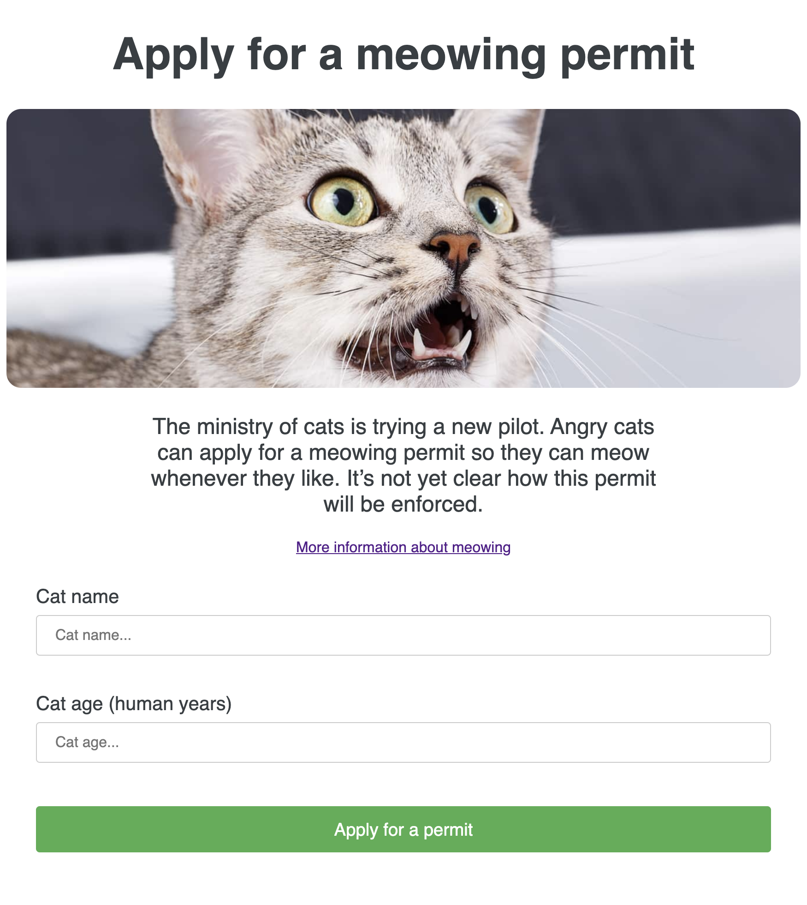
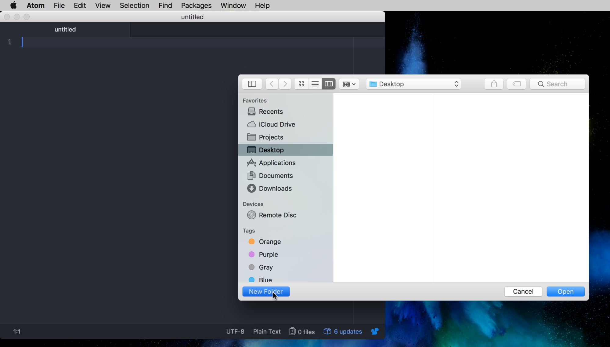
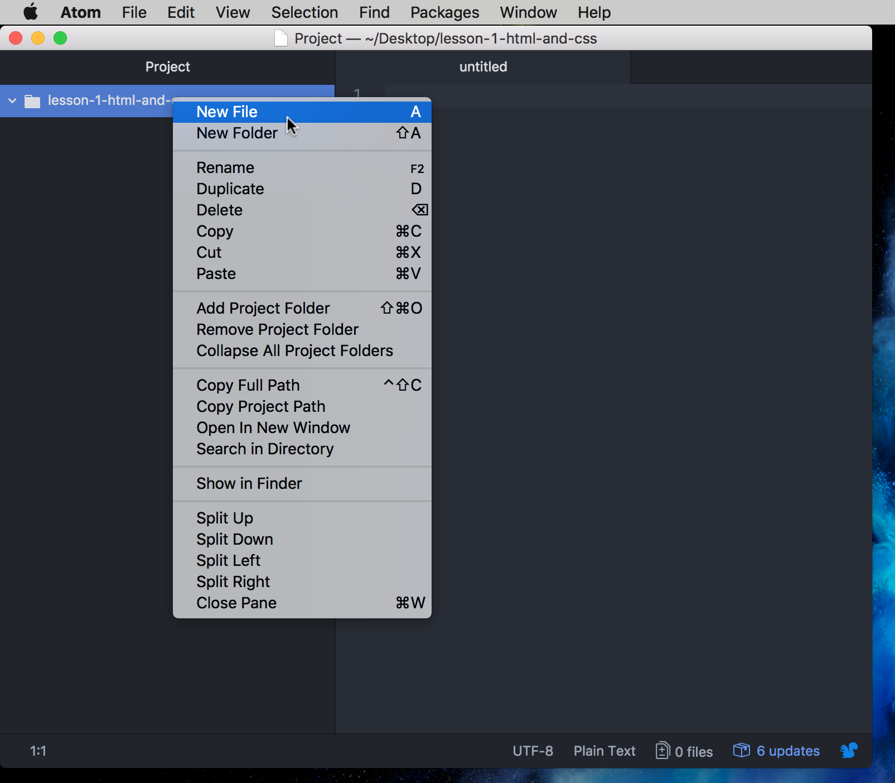

# Lesson 1: HTML and CSS

## Introduction

### Objectives

In this tutorial we are going to look at:

* what is HTML?
* what is an element?
* webpage structure
* fundamental HTML elements
* applying styles with classes and CSS

### Goal

By the end of this tutorial you will have built: 

This webpage contains a heading, some body text, two forms and a button.

Even though HTML and CSS are not programming languages they’re important fundamentals, and they’ll help you understand how the internet works.

We’ll cover programming languages (like Javascript and Ruby) in future lessons.

## Introduction to HTML and CSS

### What do HTML and CSS stand for?

HTML stands for Hyper Text Markup Language

CSS stands for Cascading Style Sheets

### What are HTML and CSS?

HTML is the language used to build websites. All text and content that you see on the internet is built using HTML.

CSS is used with HTML to style the page.

Whenever you go to a website (e.g. www.gov.uk) your browser sends a request to a special computer called a "server". The server sends back HTML and CSS, which your browser turns into a webpage for you to look at.

## HTML elements

An element is an HTML building block. There are paragraphs, headings, links, lists, and many more.

HTML elements are made up of an opening tag (sometimes including some attributes), content, and a closing tag.


<small>(<a href="https://en.wikipedia.org/wiki/HTML_element#Syntax">Image from wikipedia</a>)</small>

See the [Mozilla HTML elements reference documentation](https://developer.mozilla.org/en/docs/Web/HTML/Element) for more information.

## Webpage structure

### `doctype` and `HTML`

The doctype is the first thing that must be defined in an HTML page. It tells the browser which version of HTML the page is using.

```html
<!doctype html>
```

These days you will only ever need to use `html`. There used to be lots of complicated doctypes in the olden days. See the [W3C documentation on doctypes and markup styles](https://www.w3.org/wiki/Doctypes_and_markup_styles) for more information.

The doctype is always followed by the `<html>` tag, which contains the contents of your page.

```html
<!doctype html>
<html>
</html>
```

### `head` and `body` tags

A HTML page is split into two parts. The `head` and the `body`.

The `head` contains webpage information like the page title (the text in the
browser tab), stylesheets, scripts and other information about the page.
Everything in the `head` is invisible - you can’t put an image or a paragraph
of text in `head`.

The `body` contains webpage content that is visible to the user.

## Presentational HTML Elements

Let's start by defining the basic structure of your website.

Open Atom and create a new folder for your work called `lesson-1-html-and-css`. Select **File > Add Project Folder...** and select the correct folder:


<details>
<summary>Screenshots showing how to add a folder in Atom</summary>
 File > Add Project Folder..." src="source/images/lesson-1/image4.png">

</details>

Then inside this folder create a new file called `index.html` by right-clicking the project folder, and selecting **New File**:

<details>
<summary>Screenshot showing how to add a file in Atom</summary>

</details>

### Task 1: doctype, html, head and body

Using what we just learnt, and with guidance from us, do the following:

* declare the doctype to be HTML
* open and close a set of `<html></html>` tags
* Within this, create the `head` and `body` tags

Once you've done this, open `index.html` in your web browser:


<details>
<summary>Screenshot showing how to open the HTML file in Google Chrome:</summary>

</details>

Do you see anything on the page?

### Task 2: set the page title

Now inside your head tag create a `<title>` tag with `Apply for a Barking Permit` as your title.

You should see that the title of the tab in your browser has changed. If not, double check your code.

```html
<!doctype html>
<html>
  <head>
    <title>Apply for a meowing permit</title>
  </head>
  <body>
  </body>
</html>
```

Notice how in our example each tag is indented to its parent tag. It’s not required
but it makes your code much more readable and you’ll be able to see nested tags more easily.

In HTML multiple spaces and newlines all get squished down into one space.

```
You      can
write

text       like    this
```

and they’ll end up getting displayed with all the space squished, like so:

```
You can write text like this
```

### Element: heading (`h1`)

Headings come in 6 levels:

```html
<h1>Heading</h1>
<h2>Heading</h2>
<h3>Heading</h3>
<h4>Heading</h4>
<h5>Heading</h5>
<h6>Heading</h6>
```

A `h1` defines the most important heading whereas a `h6` defines the least important.

Headings should go from `h1` to `h6` in order - always start from `<h1>`, next use `<h2>`, and so on.

It's important to not skip one or more heading levels - this is because screenreaders can jump from heading to heading and leaving a heading level out may lead to a user being confused.


Don't:

```html
<h1>Heading 1</h1>
<h3>Heading 3</h3><!-- Oh no! A h3 shouldn't be the next heading after a h1 -->
<h4>Heading 4</h4>
```

Do:

```html
<h1>Heading 1</h1>
<h2>Heading 2</h2>
<h2>Another heading 2</h2><!-- A heading can follow a heading of the same level -->
<h2>Yet another heading 2</h2>
<h3>Heading 3</h3>
```

Headings can skip a level when going back up to a more important heading level:

```html
<h1>Heading 1</h1>
<h2>Heading 2</h2>
<h3>Heading 3</h3>
<h4>Heading 4</h4>
<h2>Another heading 2</h2><!-- This h2 following a h4 is okay -->
<h3>Another heading 3</h3>
```

#### Task 3: add a heading

Add a `h1` heading tag, which includes the phrase `Apply for a meowing permit`, inside the `body` tag of your page.

### Element: paragraph (`p`)

Putting content into a `<p>` tag will break your text up into paragraphs.
This helps make the content of your page easier to read for the user.

#### Task 4: add a paragraph

Add the following paragraph inside your `<body>` tag, after the `<h1>`:

```html
<p>
    The ministry of cats is trying a new pilot. Angry cats can apply for a
    meowing permit so they can meow whenever they like. It’s not yet clear how
    this permit will be enforced.
</p>
```

### Element: link (`a`)

A link lets the user go to another webpage. We use the attribute `href` to indicate where you want the user to go.

The link tag is called `a` for "anchor".

#### Task 5: add a link

Add a link to the end of your paragraph:

```html
<a href="https://en.wikipedia.org/wiki/Meow">
More information about meowing
</a>
```

### Element: div (`div`)

A div tag lets you group elements together. Grouping elements is useful as we can later style them together (e.g. giving them all the same colour).

#### Task 6: add a div

Wrap your existing paragraph, link and heading in a div:

```html
<div>
  <h1>Apply for a meowing permit</h1>
  <p>
    TThe ministry of cats is trying a new pilot. Angry cats can apply for a
      meowing permit so they can meow whenever they like. It’s not yet clear how
      this permit will be enforced.
    <a href="https://en.wikipedia.org/wiki/Meow">More information about meowing</a>.
 </p>
</div>
```

It's called "div" for "division".

### Element: image (`img`)

So far we've learned a lot about how to add text to our page. Now let’s add some images!

Before we start, we'll need to add the image files we want to use to the
project folder.

It's common to keep images in their own folder, so first,
create a folder called `images` inside the same folder as your HTML file.

Next, download the images you'll need. Do this by right-clicking each of
the following links, select 'Save Link As...', and save it to the images folder
you just created:

* [cat-meow.png](source/images/lesson-1/cat-meow.png)
* [cat-smile.png](source/images/lesson-1/cat-smile.png)

Images are primarily made up of three components:

* the `` tag
* the `src` attribute, which gives the location, or source, of the image
* the `alt` attribute, which is displayed if the image can't be shown, and is read by screen reader software

In order for us to see this image on the webpage we need to link to the
image, this involves telling the webpage where it is and what it is called.

#### Task 7: add an image

After the main heading of the page, add the following:

```html

```

Here you can see we have told the `src` of the image to look in the images
folder and display the image `cat-meow.png`, then we have given it a
description in the `alt` attribute.

## Forms

Forms let you ask your user for input. There are a number of interactive
components (like text boxes and buttons) you can use in forms.

### Element: form (`form`)

The `<form>` element groups a set of components together so all of the inputs
can be submitted at once.

#### Task 8: create an empty form

Create an empty form at the end your `<div>`:

```html
    ...
    <form>
    </form>
  </div>
</body>
```


### Elements: label (`label`) and input (`input`)

Labels and Inputs work together to tell the user what information they need to provide and to let them enter it.

`<label>` elements have a `for` attribute and `<input>` elements have an `id`
attribute. The combination of `for` and `id` link the elements together.

`<input>` elements also have a `name` attribute which is used when the form is
submitted. Most of the time the `id` and `name` attributes have the same value.

It's common to wrap a label / input pair in a `<div>` so they’re grouped together nicely.

#### Task 9: add labels and inputs

Let’s create a couple of inputs in the form to ask the user for the name and age of their dog:

```html
<form>
    <div>
        <label for="cat-name">Cat name</label>
        <input id="cat-name" name="cat-name">
    </div>
    <div>
        <label for="cat-age">Cat age (human years)</label>
        <input id="cat-age" name="cat-age">
    </div>
</form>
```

### Element: button (`button`)

The final thing our form needs is a way for the user to submit their answers.
In HTML we use the `<button>` tag for creating buttons.

#### Task 10: add a button

Add a `<button>` just before the end of your `form`:

```html
<button>Apply for a permit</button>
```

#### Task 11: what happens when the user submits the form?

If you select the button it looks like the page just refreshes, but nothing
changes. What's going on?

If you look closely you’ll notice that the answers you put in the form are
appearing in the URL - this is the simplest way of submitting data. In a
later session we'll cover how to handle this information "on the server" so
you can show the user a nice confirmation page.

## Styling with CSS

CSS is the language used to style websites.

It defines the visual representation of the content. For example colour, margins, borders, backgrounds, position in the page.

### What can I do with CSS?

You can change the color, position, dimensions and presentation of different elements.

### Anatomy of a CSS rule

Here's an example CSS rule:

```css
body {
  color: hotpink;
}
```

This rule would set the text colour for the `body` to a nice shade of `hotpink`.

<%= warning_text('`color` is spelt using the American spelling') %>

There are three parts:

* A `selector`, which restricts which elements this rule applies to. In this example, the `selector` is `body`.
* One or more `properties`, which define which things the rule changes. In this example, the `property` is `color`.
* A `value` for each `property`. In this example, the `value` is `hotpink`.

```css
selector {
  property1: value1;
  property2: value2;
}
```

There are two ways you can use CSS to style your page:

* using the style tag to write your CSS "inline", that is directly in your HTML file
* using the link tag to load your CSS from an external file

### Element: style

A `<style>` tag lets you write CSS directly inside your HTML.

#### Task 12: add some inline CSS

Jazz up your site with some CSS. Inside the `<head>` element add a new
`<style>` element like the following:

```html
<head>
  <title>Apply for a meowing permit</title>
  <style>
  body {
    background: hotpink;
    color: cyan;
    font-family: cursive;
  }
  </style>
</head>
```

Too much? Play around with the values until you find something you like.

### Element: link

The `<link>` tag lets you load CSS from another file. This is easier to
maintain and can be reused across several pages.

#### Task 13: replace inline CSS with external CSS

Replace your style tag with a link tag like the following:

```html
<head>
  <title>Apply for a meowing permit</title>
  <link rel="stylesheet" href="source/css/lesson-1/style.css">
</head>
```

This includes the CSS file from the project. We need now to apply some classes.

## Applying styles with classes

Often you don’t want to apply a style to *every* element, but just to certain
ones that mean something to you. For example, you might want to make one
heading use a big font and another one somewhere else on the page use a small
font.

Classes allow you to label certain elements. You can then target them in your
CSS by using the class name prefixed with a dot. For example:

### HTML

```html
<h1 class="top-heading">Apply for a meowing permit</h1>
```

### CSS

```css
.mega-big-heading {
  font-size: 100px;
}
```

### Task 14: add classes to your HTML

Try to add classes to your HTML with the parameters you like and reload the page in your browser
to see what happens:

* `class="width-container"` (to your outermost div)
* `class="top-heading"` (to your main heading)
* `class="img"` (to your image)
* `class="body-text"` (to your paragraph)
* `class="link"` (to your a tag link)
* `class="form-global"` (to both of the divs outside your labels and inputs)
* `class="label-input"` (to both of your labels block)
* `class="label-text"` (to both of your labels text)
* `class="input-text"` (to both of your inputs)
* `class="button-validation"` (to your button)

**Bonus :**
* `class="button-validation:hover"` (to your button when hover to change the state)

## Summary

Once you've done all the tasks, you should have some HTML that looks something like this:

```html
<!DOCTYPE html>
<html lang="en" dir="ltr">
<head>
    <meta charset="utf-8">
    <title>Apply for a meowing permit</title>
    <link rel="stylesheet" href="style.css">
</head>
<body>
<div class="width-container">
    <h1 class="top-heading">Apply for a meowing permit</h1>
    
    <p class="body-text">The ministry of cats is trying a new pilot. Angry cats can apply for a
        meowing permit so they can meow whenever they like. It’s not yet clear how
        this permit will be enforced.</p>
    <a class="link" href="https://en.wikipedia.org/wiki/Meow">More information about meowing</a>
    <form class="form-global">
        <div class="label-input">
            <label class="label-text" for="cat-name">Cat name</label>
            <input class="input-text" id="cat-name" name="cat-name" placeholder="Cat name...">
        </div>
        <div class="label-input">
            <label class="label-text" for="cat-age">Cat age (human years)</label>
            <input class="input-text" id="cat-age" name="cat-age" placeholder="Cat age...">
        </div>
        <button class="button-validation">Apply for a permit</button>
    </form>
</div>

</body>
</html>
```

And your CSS should look like something like that:
```css
.width-container {
max-width: 100%;
}

.top-heading {
font-family: sans-serif;
font-size: 3em;
color: #383e42;
text-align: center;
}

.body-text {
font-size: 1.5em;
font-family: sans-serif;
color: #383E42;
margin: 1em 6em 1em 6em;
text-align: center;
}

.img {
  max-width: 100%;
  border-radius: 1em;
  border-color: #383e42;
}

.link {
  display: flex;
  justify-content: center;
  font-family: sans-serif;
  font-size: 1em;
}

.form-global {
  margin: 0 2em 0 2em;
}

.label-input{
  display: flex;
  flex-direction: column;
  width: 100%;
  margin-top: 2em;
}

.label-text {
font-family: sans-serif;
font-size: 1.3em;
color: #383e42;
}

.input-text {
  width: 100%;
  display: inline-block;
  padding: 12px 20px;
  margin: 8px 0;
  border: 1px solid #ccc;
  border-radius: 4px;
  box-sizing: border-box;
  font-family: sans-serif;
  font-size: 1em;
}

.button-validation {
  width: 100%;
  background-color: #4CAF50;
  color: white;
  font-family: sans-serif;
  font-size: 1.2em;
  padding: 14px 20px;
  margin: 2em 0 2em 0;
  border: none;
  border-radius: 4px;
  cursor: pointer;
}

.button-validation:hover {
  background-color: #450049;
}

```

And your website should look something like:

This webpage contains a heading, some body text, two forms and a button.

If things don't look quite right, or if you've got any questions, ask a
us and we should be able to help you out.
