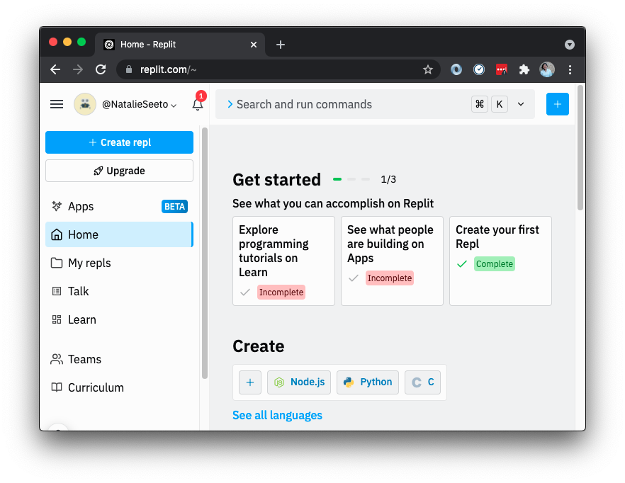
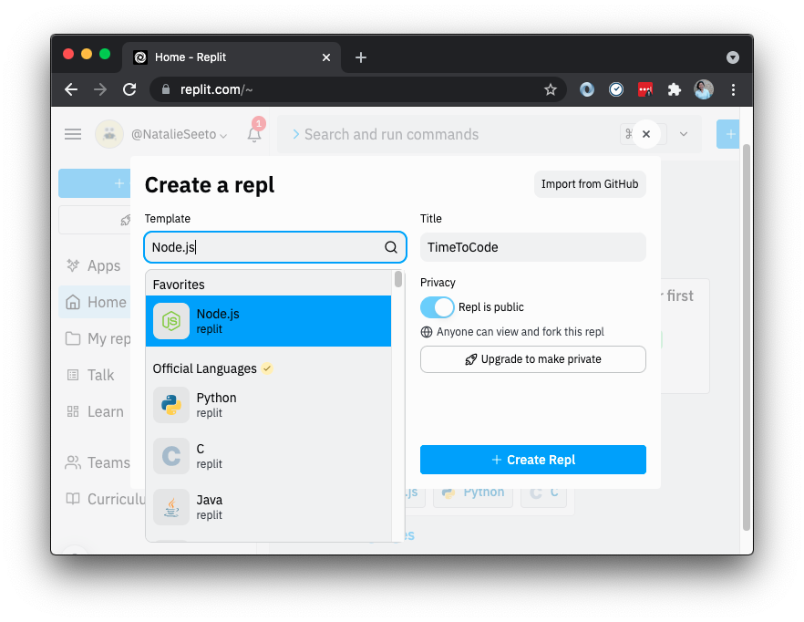
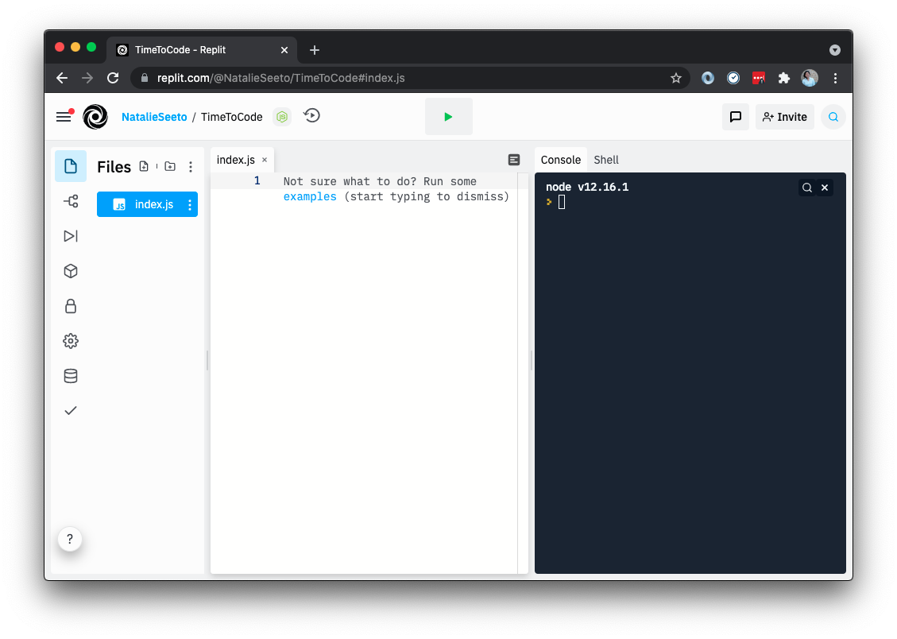
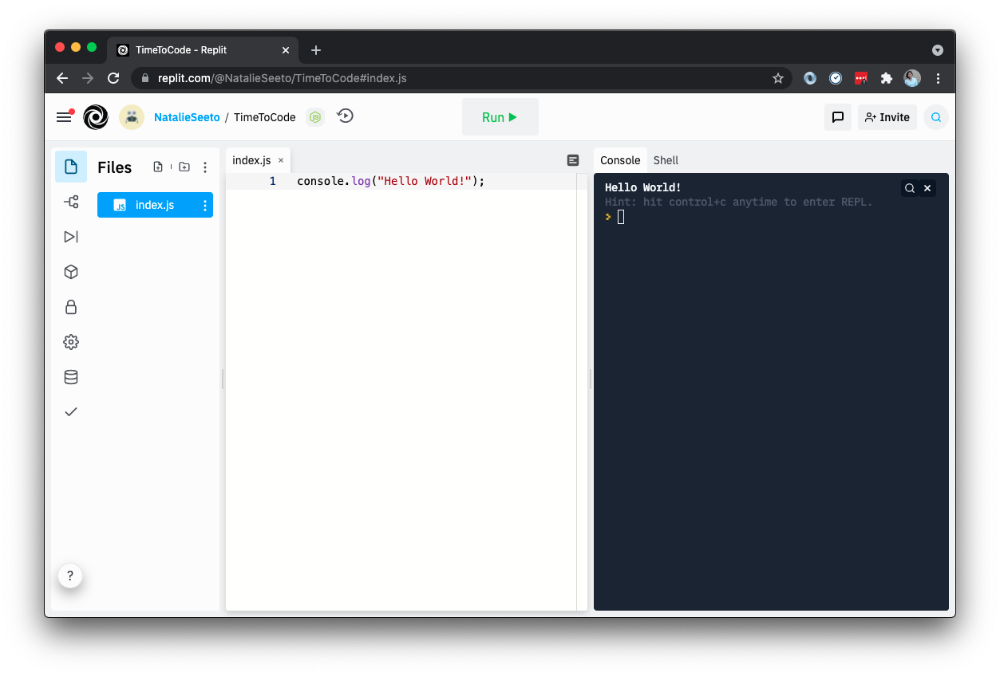

# Lesson 2: JavaScript and the Command Line

## Introduction for this lesson

### Objectives

In this tutorial we are going to look at:

* what a command line is
* how to use the command line to navigate the file system and run programs
* what JavaScript is
* console.log()
* data types
* how to use variables
* writing and invoking functions

### Goal

By the end of this tutorial you will have learnt how to navigate through the command line and how to run some basic operations in JavaScript.

---
## Introduction to the command line

### What is the command line?

The command line is a text interface for your computer. Similar to Windows Explorer on Windows or Finder on a Mac, it lets you navigate through the files and folders of your computer - but it is completely text based. The command line works by typing commands against a prompt, which then gets passed to the operating system of the computer that runs these commands.

### How do I access the command line?

On a Mac you can access the command line by opening the Terminal application
from the **Applications > Utilities** folder (or use `cmd (⌘) + space` and search
for "Terminal").

The command line can seem unfamiliar and scary, but it's really a different way of interacting with your computer. This tutorial only covers safe commands that will not do anything bad to your computer, even if you get them wrong.

### Navigating around in the terminal

Once you've opened up your terminal you should see a window that has says "Last login" with a date after it, and a cursor next to a dollar sign.

Do not worry if the text in yours is a little different - it does not matter.

Basic commands are written on a single line, and run when you press the `Enter` button on your keyboard.

Try typing, then pressing `Enter`:

```shell
pwd
```
---
#### `pwd` or print working directory

The `pwd` command prints to the command line the current directory (another name for folder) you are in. If you have just opened up your terminal, you are probably in your "home" directory, and should get an output similar to this:

```
/Users/your-username
```

So your current "working directory" is `/Users/your-username`.

---
#### Getting things wrong on the command line

If you type a command that the command line does not understand, it will show you an error message. Do not panic if you see one of these - everything is fine! Take a look at the command you wrote and see if you can work out what was wrong.

Try this for example:

```shell
whargleblargle
```

You should see an error message like `-bash: whargleblargle: command not found`.

If you want to cancel your current entry, you can either delete the command using the backspace button, or press `Ctrl + C` to get a brand new line.  Your mouse will not work for navigating around the command line commands - but you can use the arrow keys on your keyboard to move the cursor left and right.

---
#### `ls` or list

You might wonder "how I do know which files are in a directory?", the `ls` command can do this:

```shell
ls
```

This should print a list of the files and folders inside the working
directory. You'll probably see directories like `Applications`, `Desktop`, `Documents` and `Downloads`.

---
#### `cd` or change directory

The `cd` command allows you to move between directories. You tell `cd` which directory to move to by putting the path after the `cd`, like this:

```shell
cd Desktop
```

Lots of commands need parameters like this - for example, `cd` needs to know the directory to move to, while `pwd` does not. We call the parameters "arguments".

---
#### Task 1: Change to the directory containing your code

In Lesson 1 we created a folder to keep our source code
(`lesson-1-html-and-css`). Create a new folder for lesson 2 called
`lesson-2-javascript` and change the working directory in your command line using
`cd`.

Confirm you're in the right place by running:

```shell
pwd
```

and check what files there are in this directory by running:

```shell
ls
```

There probably will not be any files because we have not created any yet.

#### Notes

In Finder you can copy the path to a directory by right clicking, holding
down the option key (`⌥`), and choosing *Copy "Directory" as Pathname*.
Alternatively, you can drag the folder onto the terminal and it will type
the path for you.

If your directory includes spaces (or other weird characters) you might
need to put it in quotes so the command line does not get confused. So:

```bash
$ cd '/Users/your-username/My Directory With Spaces/lesson-2-javascript'
```

instead of

```bash
$ cd /Users/your-username/My Directory With Spaces/lesson-2-javascript
```
---
## Introduction to JavaScript
JavaScript is a great language to learn. It is run on all modern web browsers and is used to change what is displayed on the web page in response to a user's activity.

As the official language of the web, you can build websites and applications with JavaScript alongside HTML and CSS.

### Running JavaScript interactively with Repl.it
As you write code, you'll want to be able to see what it does. For this, you need to "run it" somewhere. You can do this in a number of ways, but to keep things simple today, we are going to use a tool called [Repl.it](https://replit.com/).

- Create an account using your email address.
- Click the 'Create Repl' button in the top left hand corner to start a new project.
- Under the 'Template' drop down, make sure to select 'Node.js' as your language of choice
- Under the 'Privacy' title ensure your Repl is public, this will allow you to share your code with others if you'd like to.
- Click the 'Create Repl' button

You should now have your own coding playground to play with!

<div style="border: 1px solid grey;">



</div>


### Hello World!
It is programming tradition that we begin our coding journey by running 'Hello World!' in our language of choice. So this will be the first thing we do in JavaScript using something called a `console.log()`.

The "console" is where you can see the output of your code. In Repl, you should see a console on the right.

We want to print "Hello world!" to the console. Thankfully in JavaScript there is a built-in way to do this, using a `console.log()`. You just need to put any text inside quotes, inside the parentheses, and when you run the code you should see that text printed to the console.

### Try it out
Write this in your Repl:

```
console.log('Hello world!');
```

Click "run" and check the console. You should see "Hello world!" printed out on the right-hand side. It'll look something like this:

<div style="border: 1px solid grey;">

</div>

You also might be wondering why there's a semicolon at the end of the code you wrote. Semicolons are used at the end of every statement in JavaScript. The code usually won't break if you forget it, but it's good practice to remember.

---
## Data Types
If you played around with `console.log()` in the last step, you might have noticed that words always have to be inside quotes or else the code breaks, whereas numbers can work without quotes. Why is this? Well there are different data types in JavaScript. We're going to learn the three main data types right now (later we'll look at some other data types, like objects and arrays).

### Strings

In the real world strings tie things up. Programming strings have *nothing* to do with real-world strings.

Programming strings are used to store collections of letters and numbers.
That could be a single letter like `"a"`, a word like `"hi"`, or a sentence like
`"Hello my friends."`.

A JavaScript string is always written inside a pair of quotes (single or double). The shortest possible string is called the empty string: `""`. It’s not uncommon for a single string to contain paragraphs or even pages of text.

If you type a string in your Repl using `console.log()` and run it, it will return it back at you:

```
console.log("hello");
=> hello
```

### Integers
Numbers are known as "integers" in JavaScript. they do not need to be wrapped in quotes like strings and can be written as is:
`100`

We can use JavaScript as a kind of calculator. Try typing `console.log(1 + 1)` into your Repl and click "run". Do you get the right answer?

In JavaScript, the `+` operator adds numbers together. Other operators include:

* `-` - subtract
* `*` - multiply
* `/` - divide

You can also use brackets (`()`) to group things, e.g. `(2 + 2) / 2` which would evaluate to 2, rather than `2 + 2 / 2` which would evaluate to 3.

---
#### Task 2: Maths challenge

Use your Repl to work out the answer to "191 multiplied by 7".

<details>
<summary>Answer</summary>

```
console.log(191 * 7);
=> 1337
```

</details>

---
### Booleans
A "boolean" value denotes if a statement is true or false. A boolean can only be `true` or `false` and is always written without quotes.

### `typeof`
You've seen what they look like, now make sure they are what you think they are. There is a built-in feature in JavaScript which allows you to check the type of a particular value: `typeof`

Write this code in your Repl and click 'run':
```
console.log(typeof "hello");
```
You should see `string` printed to the console. This is because 'hello' is a string data type.

---
#### Task 3: Check the types
Try to log the `typeof` three different values, `"hello"`, `102`, `false`. You should get a different output for each one.

<details>

```
console.log(typeof "hello");
console.log(typeof 22);
console.log(typeof true);

=> number
=> string
=> boolean
```
</details>

---
## Variables

Programming is all about creating abstractions, and in order to create an
abstraction we must be able to assign names to things. Variables are a way of creating a name for a piece of data.

Creating variables in JavaScript by using the keyword `var`, this lets the application know that you're about to store a value. You will also need to give a name to your variable.

```JavaScript
var name = "Ralph";
var ageHumanYears = 4;
var ageDogYears = ageHumanYears * 7;

console.log(ageDogYears);
```

This would give three variables: `name` with a value of `"Ralph"`, `ageHumanYears` with a value of `4` and `ageDogYears` with a value of `28`.

Variable names in JavaScript have to start with a letter, and they can not contain spaces or "special" characters like `-`, `$`, `@` and `&`.

As a style convention, JavaScript variables use capitalises the first letter of the next word to separate the bits of the name - this is called `camelCase` (as opposed to `snake_case` or `PascalCase` which are used elsewhere).

---
#### Task 4: Set and use a variable

Use your Repl to set a variable called `answer` to the value of `7` multiplied by `6`. Multiply the `answer` variable by `10` in Repl to see what happens.

<details>
  <summary>Answer</summary>

```
var answer = 7 * 6;
console.log(answer);
console.log(answer * 10);
console.log(answer);

=> 42
=> 420
=> 42
```

</details>

---
## Functions

While programming, we often find ourselves doing the same thing over and over again. It would be nice if we could give a particular task a name, and run it by calling its name.

In JavaScript we do this with *functions*. A function is a block of code designed to perform a particular task. A function is executed when it is "invoked".
The syntax of a function looks like this:
```
function functionName (parameters) {
  // code to be executed
}
```

You can call a function whatever you want, just like a variable. You can also give a function different values every time you run it which are called "parameters".

To make the function run, we invoke it like so:
`functionName();`

Let's write a function that adds two numbers together. We'll call it `sum`, we want to add two different numbers each time, so we'll need to define two parameters to represent this, `x` and `y`.

```
function sum (x, y) {
  // code to be executed
}

sum(2, 3);
```

Notice, we have invoked the function underneath with the parameters `2` and `3`. Inside the function try to `console.log()` both `x` and `y` and see what happens. What happens when you try logging them on the outside of the function? They should be undefined, because we can only access those parameters from inside the function.


Now, we want to add those numbers together, but we need to write more than just `x + y`. We also need to tell the function to return something. So we need a `return` statement. The `return` statement specifies the value to output to the console.

```
function sum (x, y) {
  return x + y;
}

sum(2, 3);
```
Run this code and see what you get.

---
#### Task 5: Maths
Write a function called `multiply` that multiplies two numbers together. This function should take in two parameters and return the answer.

<details>

```
function multiply (x, y) {
  return x * y;
}

multiply(2, 8);
```
</details>

---
### ES5 vs ES6
One thing about programming languages is they are always evolving. JavaScript is no different, whenever new features are added to the language, there will be a new ES version of JavaScript.
Up until now we have mostly been writing ES5. ES5 is good to know as it gives us a better understanding of the language, and you might come across books or code that use ES5 syntax.

ES6 is a newer version of JavaScript and adds features to the existing ES5, it is also widely used in the industry.

One new feature of ES6 is `arrow functions` which is a more concise way of creating functions.

If we take the above function example and re-write it into ES6 using arrow functions we get:
```
const sum = (x, y) => x + y;

sum(2, 3);
```

Let's break down what is happening here. First we name the function, `sum` and store it in the variable using the `const` keyword.
The `const` keyword is a new feature of ES6, which is used to declare a variable that we want to remain constant ie: unchangeable.
A second keyword, `let`, which is available in ES6, can also be used to declare a variable.
The difference between `const` and `let` is that `let` variables can be updated, whereas `const` variables cannot be updated.
You'll see `let` appear again later on in the workshop.

Both `const` and `let` have replaced the ES5 keyword `var` and gives us more control over our code.

By storing the function in a variable, we are able to invoke it with different parameters.

Try putting `(x, y) => x + y` in your Repl. You should get an output that says `[Function]` - this means JavaScript recognises this as a function.

Now add to your code so it looks like:

```
const sum = (x, y) => x + y;

console.log(sum(1,2));
```

Did your function return the correct answer?

Notice how we didn't need to use the `return` statement here.
The ability to write a function inline is one advantage of arrow functions.
Note, if your function has more than one expression, it is good practice using the `{}` and `return` keyword.

Below is the same function written with `{}` and `return` keyword:

```
const sum = (x, y) => {
  return x + y;
}

console.log(sum(1,2));
```
